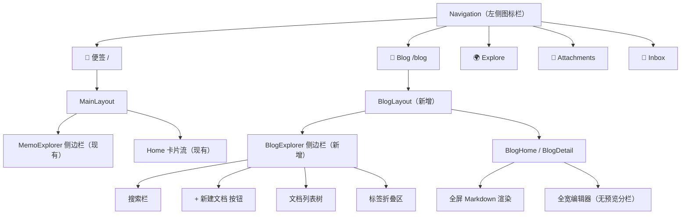
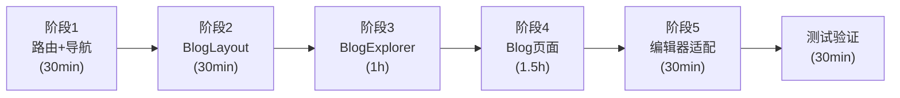

# Memos 双模式改造方案：便签 + Blog

## 一、目标概述

在 Memos 中实现**两种并行模式**，通过左侧 Navigation 图标栏切换：

1. **便签模式**（现有，完全保留）：卡片流 + compact 编辑器，适合快速记录碎片化想法
2. **Blog 文档模式**（新增）：Outline 风格，侧边栏文档树 + 全屏 Markdown 编辑，适合写长文/技术文档

### 最终效果

```
┌──────┬──────────────────────────────────────────────┐
│ Nav  │                                              │
│ 64px │   根据当前模式显示不同内容                      │
│      │                                              │
│ [📝] │ ← 便签（现有 Home，不动）                      │
│ [📄] │ ← Blog（新增，Outline 风格文档页）              │
│ [🌍] │ ← Explore（现有，不动）                        │
│ [📎] │ ← Attachments（现有，不动）                    │
│ [🔔] │ ← Inbox（现有，不动）                          │
│      │                                              │
└──────┴──────────────────────────────────────────────┘
```

---

## 二、两种模式对比

| 维度 | 便签模式（保留） | Blog 文档模式（新增） |
|---|---|---|
| **入口** | Navigation `📝 Memos` 图标 | Navigation `📄 Blog` 图标（新增） |
| **路由** | `/`（现有 Home） | `/blog`（新增） |
| **侧边栏** | MemoExplorer（搜索、日历、标签） | **BlogExplorer**（文档列表树、新建按钮） |
| **主内容** | 卡片流列表 + compact 编辑器 | 全屏文档内容（Markdown 渲染） |
| **编辑方式** | 首页 compact 编辑器 / 详情页分栏预览 | 点击进入独立文档页，全宽编辑（无预览） |
| **新建方式** | 首页顶部直接输入 → 保存 | 侧边栏「+ 新建」→ 跳转新文档页 |
| **列表展示** | MemoPreviewCard（标题+摘要卡片） | 侧边栏条目（仅标题，树形列表） |
| **数据来源** | 所有 memo | 带特定标签（如 `#blog`）的 memo，或所有 memo |

---

## 三、架构设计

### 3.1 路由结构

```
当前路由:
RootLayout
  ├── MainLayout（含 MemoExplorer 侧边栏）
  │     ├── /             → Home（便签卡片流）
  │     ├── /explore      → Explore
  │     ├── /archived     → Archived
  │     └── /u/:username  → UserProfile
  ├── /memos/:uid         → MemoDetail（无侧边栏）
  ├── /attachments        → Attachments
  ├── /inbox              → Inboxes
  └── /setting            → Setting

新增路由:
RootLayout
  ├── MainLayout ...（不变）
  ├── BlogLayout（新增，含 BlogExplorer 侧边栏）
  │     ├── /blog              → BlogHome（显示最近文档或空状态）
  │     └── /blog/:uid         → BlogDetail（全屏文档编辑/查看）
  ├── /memos/:uid ...（不变）
  └── ...（其他不变）
```

### 3.2 组件架构



---

## 四、详细改造任务

### 阶段 1：新增路由和导航入口

#### 1.1 添加 Blog 路由常量

**文件**: `web/src/router/routes.ts`

**改动**: 添加 `BLOG: "/blog"`

```typescript
export const ROUTES = {
  ROOT: "/",
  BLOG: "/blog",        // ← 新增
  ATTACHMENTS: "/attachments",
  INBOX: "/inbox",
  ARCHIVED: "/archived",
  SETTING: "/setting",
  EXPLORE: "/explore",
  AUTH: "/auth",
} as const;
```

#### 1.2 注册 Blog 路由

**文件**: `web/src/router/index.tsx`

**改动**: 添加 BlogLayout 和子路由

```typescript
const BlogLayout = lazy(() => import("@/layouts/BlogLayout"));
const BlogHome = lazy(() => import("@/pages/BlogHome"));
const BlogDetail = lazy(() => import("@/pages/BlogDetail"));

// 在 RootLayout children 中添加：
{
  element: <LazyRoute component={BlogLayout} />,
  children: [
    { path: "blog", element: <LazyRoute component={BlogHome} /> },
    { path: "blog/:uid", element: <LazyRoute component={BlogDetail} /> },
  ],
},
```

#### 1.3 添加 Blog 导航图标

**文件**: `web/src/components/Navigation.tsx`

**改动**: 在 navLinks 数组中添加 Blog 入口（位于 Memos 和 Explore 之间）

```typescript
import { FileTextIcon } from "lucide-react";  // 新增

const blogNavLink: NavLinkItem = {
  id: "header-blog",
  path: Routes.BLOG,
  title: "Blog",
  icon: <FileTextIcon className="w-6 h-auto shrink-0" />,
};

const navLinks = currentUser
  ? [homeNavLink, blogNavLink, exploreNavLink, attachmentsNavLink, inboxNavLink]
  : [exploreNavLink, signInNavLink];
```

---

### 阶段 2：新建 BlogLayout 布局

#### 2.1 创建 BlogLayout

**新文件**: `web/src/layouts/BlogLayout.tsx`

**功能**:
- 结构与 MainLayout 类似（左侧固定侧边栏 + 右侧内容区）
- 侧边栏使用 **BlogExplorer**（而非 MemoExplorer）
- 侧边栏宽度与 MainLayout 一致（md: 224px, lg: 288px）

**关键区别**:
- MainLayout 的侧边栏是 MemoExplorer（日历、标签、统计）
- BlogLayout 的侧边栏是 BlogExplorer（文档列表树、新建按钮）

---

### 阶段 3：新建 BlogExplorer 侧边栏

#### 3.1 创建 BlogExplorer

**新文件**: `web/src/components/BlogExplorer/BlogExplorer.tsx`

**布局结构**:
```
┌─────────────────────┐
│ 🔍 搜索栏           │
│ [+ 新建文档]         │  ← 点击创建空 memo → 跳转 /blog/:uid
├─────────────────────┤
│ 📄 今天              │  ← 按时间分组
│   ├ 文档标题A        │  ← 点击 → /blog/:uid
│   └ 文档标题B        │
│ 📄 昨天              │
│   └ 文档标题C        │
│ 📄 更早              │
│   └ ...              │
├─────────────────────┤
│ 🏷️ 标签（折叠）     │
│ 📦 归档              │
└─────────────────────┘
```

**功能**:
- 搜索栏：复用现有 SearchBar 组件
- 新建按钮：调用 API 创建空 memo → navigate(`/blog/${uid}`)
- 文档列表：按时间分组（今天/昨天/本周/更早），只显示标题
- 当前选中文档高亮（匹配 URL 中的 `:uid`）
- 右键菜单：归档、删除、置顶
- 标签折叠区：复用 TagsSection

#### 3.2 创建 BlogDocList 文档列表组件

**新文件**: `web/src/components/BlogExplorer/BlogDocList.tsx`

**功能**:
- 获取所有 memo 列表（使用现有的 `useMemoListQuery`）
- 提取标题（第一行 `# 标题` 或前 30 字符）
- 按创建时间分组
- 渲染为可点击的条目列表
- 支持无限滚动加载
- 选中状态与 URL 同步

---

### 阶段 4：新建 Blog 页面

#### 4.1 创建 BlogHome 页面

**新文件**: `web/src/pages/BlogHome.tsx`

**功能**:
- 默认显示最近编辑的文档（自动跳转到 `/blog/:uid`）
- 如果没有任何文档，显示空状态 + 引导创建
- 或者显示一个简洁的「最近文档」概览

#### 4.2 创建 BlogDetail 页面

**新文件**: `web/src/pages/BlogDetail.tsx`

**功能**: 类似 MemoDetail，但做以下简化：

| 对比 | MemoDetail（现有） | BlogDetail（新增） |
|---|---|---|
| 侧边栏 | 无（独立页面） | 有（BlogLayout 提供） |
| 查看模式 | MemoContent 渲染 | MemoContent 渲染（相同） |
| 编辑模式 | MemoEditor（左右分栏预览） | **全宽 MemoEditor（无预览）** |
| 切换方式 | 点击内容区域切换 | 顶部「编辑」按钮切换 |
| 右侧边栏 | MemoDetailSidebar（224px） | **无**（侧边栏已在左侧） |
| 评论区 | 有评论列表 + 评论编辑器 | 可选保留或移除 |
| 标题展示 | 无独立标题 | **独立大标题**（可编辑） |

**关键实现**:
1. 复用 `MemoContent` 渲染 Markdown 内容（Mermaid、公式、表格全部支持）
2. 编辑模式使用 `MemoEditor` 的 **compact 模式**或自定义的全宽模式（去掉预览分栏）
3. 顶栏：返回按钮 + 标题 + 编辑/保存按钮 + 更多操作菜单
4. 自动保存功能（3 秒防抖）

---

### 阶段 5：Blog 编辑器适配

#### 5.1 MemoEditor 添加 `noPreview` 选项

**文件**: `web/src/components/MemoEditor/index.tsx`

**改动**: 添加 `noPreview` prop，控制是否显示预览面板

```typescript
interface Props {
  // ...现有 props
  noPreview?: boolean;  // ← 新增：Blog 模式下为 true，隐藏预览
}
```

当 `noPreview = true` 时：
- 编辑器全宽显示（100%）
- 不渲染 EditorPreview 组件
- 不渲染可拖拽分割线
- 保留 Focus Mode 功能

**现有使用场景不受影响**：
- 便签详情页（MemoDetail）：`noPreview` 默认 false，保留分栏预览
- Blog 详情页（BlogDetail）：`noPreview = true`，全宽编辑

---

## 五、完整文件清单

### 新建文件（6 个）

| 文件 | 说明 |
|---|---|
| `layouts/BlogLayout.tsx` | Blog 模式布局（侧边栏 + 内容区） |
| `pages/BlogHome.tsx` | Blog 首页（空状态/自动跳转） |
| `pages/BlogDetail.tsx` | Blog 文档详情页（查看+编辑） |
| `components/BlogExplorer/BlogExplorer.tsx` | Blog 侧边栏容器 |
| `components/BlogExplorer/BlogDocList.tsx` | 文档列表树组件 |
| `components/BlogExplorer/NewDocButton.tsx` | 新建文档按钮 |

### 修改文件（3 个）

| 文件 | 改动 | 影响范围 |
|---|---|---|
| `router/routes.ts` | 添加 `BLOG` 路由常量 | 仅新增，无破坏 |
| `router/index.tsx` | 添加 BlogLayout 路由 | 仅新增，无破坏 |
| `components/Navigation.tsx` | 添加 Blog 导航图标 | 仅新增一个图标 |
| `components/MemoEditor/index.tsx` | 添加 `noPreview` prop | 默认值 false，现有行为不变 |

### 不改动的文件

| 文件/目录 | 说明 |
|---|---|
| `pages/Home.tsx` | 便签首页，完全保留 |
| `pages/MemoDetail.tsx` | 便签详情页，完全保留 |
| `components/MemoExplorer/` | 便签侧边栏，完全保留 |
| `components/MemoPreviewCard.tsx` | 便签卡片，完全保留 |
| `components/PagedMemoList/` | 便签列表，完全保留 |
| `components/MemoEditor/components/EditorPreview.tsx` | 预览组件保留（便签模式仍使用） |
| `lib/markdown/` | Markdown 渲染引擎，完全保留 |
| `layouts/MainLayout.tsx` | 便签布局，完全保留 |
| 所有后端代码 | 无需修改 |

---

## 六、改造后完整效果

### 6.1 便签模式（不变）

用户点击 `📝 Memos` 图标：
- 左侧 MemoExplorer：搜索、日历、标签
- 右侧卡片流列表 + 顶部 compact 编辑器
- 点击卡片 → `/memos/:uid` 详情页（含分栏预览编辑器）
- **完全与现在一样，零改动**

### 6.2 Blog 文档模式（新增）

用户点击 `📄 Blog` 图标：
1. 左侧 BlogExplorer：新建按钮 + 文档列表树 + 标签
2. 右侧显示当前选中文档的完整 Markdown 渲染内容
3. Mermaid 图表、数学公式、代码高亮、表格、复选框全部正常显示
4. 点击「编辑」→ 全宽 textarea 编辑器（无预览分栏）
5. 点击侧边栏「+ 新建文档」→ 创建空 memo → 跳转到新文档编辑页
6. 新文档显示占位提示：「输入 '/' 来插入，或开始写...」

### 6.3 数据共享

**便签和 Blog 共享同一套数据**（都是 memo）：
- 在便签模式创建的 memo，也会出现在 Blog 文档列表中
- 在 Blog 模式创建的文档，也会出现在便签卡片流中
- 如果需要区分，可以后续通过标签（如 `#blog`）过滤

---

## 七、实施顺序



**预计总工时**: ~4 小时  
**风险等级**: 低（纯新增，不改动现有功能）  
**后端改动**: 无

---

## 八、优势

1. **零破坏**: 现有便签模式完全不动，新增的 Blog 模式是独立的路由和组件
2. **代码复用**: BlogDetail 复用 MemoContent（Markdown 渲染）、MemoEditor（编辑器）
3. **数据统一**: 便签和 Blog 共享 memo 数据，无需后端改动
4. **渐进增强**: Blog 模式可以后续独立迭代（加目录、加分享、加分类等）
