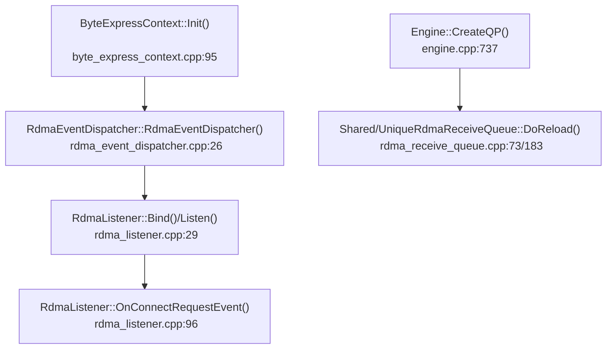
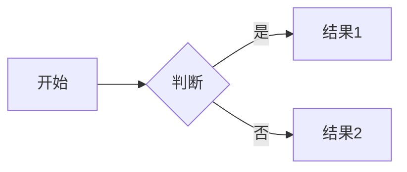

# Memos 核心功能端到端测试清单

> 用途：每次修改后，用本文件在全新的本地测试环境中执行核心端到端回归，确认 Memos 的主流程没有被破坏。
>
> 最后更新：2026-06-06
>
> 最近一次实测环境：`http://localhost:18327`，容器 `memos-test-1780745106`，镜像 tag 固定为 `test`，全新临时数据目录 `/tmp/tmp.9pQgLUyY8U`。

## 0. 强制测试原则

1. 每轮端到端测试都必须使用全新的本地环境，不复用旧容器或旧数据目录。
2. 所有测试在执行前都必须先完成真实端到端构建与启动：使用项目根目录的 `./build-push.sh` 构建镜像，再用 `./pull.sh` 启动测试环境，镜像 tag 固定为 `test`。
3. 测试判定必须基于构建后的真实网页：打开本地测试环境 URL，在浏览器页面中完成交互并观察结果。
4. 禁止用脚本、接口调用、数据库写入、localStorage 修改、控制台注入或单元测试结果替代网页端到端测试；这些只能作为辅助诊断，不能作为通过依据。
5. 除固定构建/启动命令 `./build-push.sh` 和 `./pull.sh` 外，不得编写或运行批量脚本来模拟用户操作、构造数据或直接判定用例通过。
6. 浏览器测试必须覆盖真实页面交互：注册、登录、创建、编辑、跳转、上传、刷新持久化、权限可见性。
7. 修改编辑器、Markdown、Mermaid、表格、附件、Writing 相关逻辑后，必须额外执行对应专项章节。
8. 测试发现失败时，先记录失败现象、页面 URL、控制台错误、网络请求状态，再修复并重新从失败用例开始复测。

## 1. 测试环境准备

### 1.1 构建与启动

在项目根目录执行：

```bash
./build-push.sh --local test
MEMOS_DATA_DIR="$(mktemp -d)" ./pull.sh --local --name "memos-test-$(date +%s)" test
```

构建和启动成功只表示环境就绪，不代表 E2E 通过；必须继续打开 `http://localhost:<端口>`，按第 3 节在真实网页中逐项操作验证。

如果容器内 SQLite 因权限无法创建数据库，先创建数据目录并放宽权限：

```bash
TEST_DATA_DIR="$(mktemp -d)"
chmod 777 "$TEST_DATA_DIR"
MEMOS_DATA_DIR="$TEST_DATA_DIR" ./pull.sh --local --name "memos-test-$(date +%s)" test
```

### 1.2 基础账号

| 账号 | 密码 | 用途 |
|---|---|---|
| `austin` | `Austin123` | 首个 HOST 用户，执行主流程 |
| `user1` | `User11234` | 普通用户，验证权限隔离 |

密码必须满足后端策略，至少包含大写字母、数字和足够长度。

### 1.3 基础测试数据

每轮测试至少创建以下数据：

| 数据 | 内容示例 | 用途 |
|---|---|---|
| 私有 Memo | `normal attachment e2e` | 首页私有 Memo、附件关联验证 |
| 公开 Memo | `core e2e public memo #core-e2e-public` | Explore 与匿名/普通用户可见性验证 |
| 归档 Memo | `core e2e archived memo #core-e2e-archived` | Archive / Archived 页验证 |
| Todo Memo | `- [ ] core e2e todo item #core-e2e` | Todo 聚合验证 |
| Writing 文档 | `#blog` + 正文 | `/writing`、`/blog`、BlogEditor 验证 |
| 图片附件 | `normal-upload.png` | 普通 Memo 图片上传验证 |
| 非图片附件 | `writing-upload-test.txt` | BlogEditor 文件附件验证 |
| Mermaid Memo | 标准 `flowchart LR` 代码块 | Mermaid 渲染验证 |
| 表格 Memo | 3x3 Markdown 表格 | 表格交互验证 |

## 2. 核心验收总览

| 编号 | 模块 | 必测目标 |
|---|---|---|
| E2E-01 | 首次访问与注册 | 空实例跳转注册；首个用户成为 HOST |
| E2E-02 | 登录与登出 | 正确密码登录；错误密码失败；登出后回到未登录态 |
| E2E-03 | 首页 Memo CRUD | 创建、编辑、保存、删除、可见性切换正常 |
| E2E-04 | Memo 详情 | 详情路由、原地编辑、自动保存、刷新持久化正常 |
| E2E-05 | 附件 | 图片与普通文件上传、显示、刷新持久化正常 |
| E2E-06 | Writing / Blog | `/writing` 与 `/blog` 兼容；新建空标题；编辑与删除正常 |
| E2E-07 | 表格编辑 | 插入、行列新增、行列选择删除、整表删除、方向键跳格正常 |
| E2E-08 | Mermaid / Markdown | Mermaid 渲染、失败态、代码显示隐藏、WYSIWYG 输入正常 |
| E2E-09 | Todo | Quick add、任务聚合、筛选、完成状态更新正常 |
| E2E-10 | Explore | 公开 Memo 可见；私有 Memo 不可见 |
| E2E-11 | Archived | 归档后从首页消失并出现在 `/archived`；恢复后回首页 |
| E2E-12 | Inbox | 页面加载、空态或通知列表、未读过滤正常 |
| E2E-13 | Attachments | 附件列表、搜索、已使用/未使用分组、删除正常 |
| E2E-14 | User Profile | `/u/:username` 展示用户资料、Memo 列表、地图 Tab |
| E2E-15 | Settings | HOST 看到管理设置；普通用户只能看到基础设置 |
| E2E-16 | 路由与刷新 | 所有前端路由刷新不 404，SPA fallback 正常 |

## 3. 详细端到端测试用例

### E2E-01 首次访问与首用户注册

**步骤**：

1. 启动全新环境后访问 `/`。
2. 确认自动进入 `/auth/signup` 或显示注册页。
3. 注册 `austin / Austin123`。
4. 注册成功后确认进入首页 `/`。
5. 进入 `/setting`，确认 HOST 用户能看到管理类设置入口。

**通过标准**：

- 首个用户注册成功。
- 首页显示 Memo 编辑器。
- HOST 用户可进入设置页并看到管理设置。

### E2E-02 登录、登出、错误密码

**步骤**：

1. 从用户菜单执行 Sign out。
2. 访问 `/auth`。
3. 使用错误密码登录一次。
4. 使用 `austin / Austin123` 登录。

**通过标准**：

- 错误密码不会进入首页，并出现错误提示。
- 正确密码登录后进入 `/`。
- 左侧导航显示 Home、Writing、Explore、Todo、Attachments、Inbox、Settings 等入口。

### E2E-03 首页 Memo 创建、可见性、编辑、删除

**步骤**：

1. 在首页编辑器输入 `core e2e private memo #core-e2e-private`。
2. 可见性保持 Private，点击 Save。
3. 切换可见性为 Public，输入 `core e2e public memo #core-e2e-public`，点击 Save。
4. 确认两条 Memo 都出现在首页列表。
5. 打开 Memo 操作菜单，执行 Edit，修改内容并保存。
6. 新建一条临时删除用 Memo，执行 Delete 并确认。

**通过标准**：

- Private / Public 可见性按钮生效。
- 创建后列表立即出现新 Memo。
- 编辑后内容更新且刷新仍存在。
- 删除后该 Memo 从列表消失。

### E2E-04 Memo 详情、原地编辑与自动保存

**步骤**：

1. 点击首页任意 Memo 进入 `/memos/:uid`。
2. 点击正文，确认可直接编辑。
3. 输入一段测试文本。
4. 等待自动保存状态完成。
5. 刷新页面。

**通过标准**：

- URL 为 `/memos/:uid`。
- 有权限用户正文区域可编辑。
- 自动保存不丢光标、不闪烁。
- 刷新后修改内容仍存在。

### E2E-05 附件上传与持久化

#### E2E-05A 普通 Memo 图片附件

**步骤**：

1. 在首页创建或编辑普通 Memo。
2. 上传 `normal-upload.png`。
3. 保存 Memo。
4. 打开 Memo 详情。
5. 进入 `/attachments`。

**通过标准**：

- Memo 卡片或详情显示附件数量。
- 图片附件可预览或以附件形式展示。
- `/attachments` 中能看到 `normal-upload.png`。

#### E2E-05B Writing 非图片附件

**步骤**：

1. 进入 `/writing`。
2. 新建或打开 Writing 文档。
3. 在 BlogEditor 中上传 `writing-upload-test.txt`。
4. 等待自动保存。
5. 刷新 `/writing/:uid`。
6. 进入 `/attachments`。

**通过标准**：

- 上传过程无前端控制台错误。
- 编辑器中出现附件链接或 `a.attachment` 对应展示。
- 刷新后附件仍存在。
- `/attachments` 中能看到 `writing-upload-test.txt`。

### E2E-06 Writing / Blog 文档

**步骤**：

1. 点击侧边栏 Writing，确认进入 `/writing`，不是 404。
2. 点击 New Article。
3. 确认新建文档默认标题为空，不出现 `Untitled` 和时间戳标题。
4. 文档内容应包含 `#blog` 标记。
5. 在正文中输入标题、段落、附件或 Mermaid。
6. 等待自动保存并刷新。
7. 直接访问 `/blog`，确认兼容路由正常。
8. 直接访问 `/blog/:uid`，确认能打开同一文档。
9. 删除测试文档，确认回到 `/writing`。

**通过标准**：

- `/writing` 和 `/blog` 都能加载 Writing 布局。
- `/writing/:uid` 和 `/blog/:uid` 都不 404。
- 新建文档不自动填充 `Untitled`。
- 自动保存与刷新持久化正常。

### E2E-06A Writing 保存状态红点专项

**步骤**：

1. 进入 `/writing` 并新建或打开一篇 Writing 文档。
2. 在右侧详情栏确认初始保存状态为绿色已保存。
3. 点击正文并输入 `save status e2e unsaved marker`。
4. 输入后立刻观察右侧详情栏保存状态。
5. 等待自动保存完成。
6. 刷新当前 `/writing/:uid` 页面。

**通过标准**：

- 输入后的自动保存防抖期间，右侧详情栏必须显示红色未保存状态，不能一直保持绿色已保存。
- 自动保存完成后，右侧详情栏恢复绿色已保存状态。
- 刷新后新增文本仍存在，且初始状态为绿色已保存。
- 该用例必须在真实构建后的网页中手动交互验证，不允许仅用单元测试或接口调用替代。

### E2E-07 表格交互专项

**测试数据**：创建包含 3x3 表格的 Writing 或 Memo 详情文档。

**步骤**：

1. 插入或打开表格。
2. 点击表格前后区域，确认能在表格前后放置光标并输入文字。
3. 鼠标移动到行列之间，确认只在边界处出现加号，而不是每个单元格内常驻显示。
4. 点击列间加号，新增列应插入在两列之间。
5. 点击行间加号，新增行应插入在两行之间。
6. 选择一整行，按 Delete 或 Backspace 删除行。
7. 选择一整列，按 Delete 或 Backspace 删除列。
8. 多选连续行或列后删除。
9. 选择整张表，按 Delete 或 Backspace 删除整表。
10. 在单元格中使用 ArrowUp / ArrowDown / ArrowLeft / ArrowRight。
11. 在任意表格单元格输入英文前缀后切换中文输入法，输入中文候选词，并在首次从英文切换到中文确认时按 Enter。
12. 在同一单元格普通按 Enter。
13. 在表格后输入文字，保存并刷新。

**通过标准**：

- 表格前后都能点击并继续输入。
- 加号只在行列边界 hover 时出现。
- 新增行列位置正确。
- 行、列、多选、整表删除稳定。
- 方向键直接跳到相邻单元格，不出现先进入当前格文本光标的中间状态。
- 中文输入法 composition/候选确认期间的首次 Enter 不会拆分表格、移动行列、把单元格内容提升为普通段落，表格行列数量保持不变。
- 普通 Enter 在单元格内只新增单元格内部段落，表格整体行列结构保持不变。
- 表格后的输入不会导致表格被 DOMParser 合并成普通段落或消失。

### E2E-08 Mermaid、Markdown 与 WYSIWYG

**步骤**：

1. 创建包含以下内容的 Memo 或 Writing 文档：

````markdown
# Mermaid E2E





- [ ] task from markdown

> quote text

1. ordered item
````

2. 打开详情页或 Writing 编辑页。
3. 确认 Mermaid 显示为 SVG 图形。
4. 在 Blog 编辑页点击 Mermaid 图，测试显示代码 / 隐藏代码。
5. 故意改坏 Mermaid 语法，确认失败态和重新渲染入口。
6. 新行输入 `# `、`## `、`> `、`- `、`1. `、三个反引号加 `mermaid`、`---`。

**通过标准**：

- Markdown 元素渲染正确。
- Mermaid 正常渲染为图形，不是纯代码文本。
- Mermaid 错误语法有明确失败提示，不导致页面崩溃。
- WYSIWYG 输入规则能转换为对应块级节点。

### E2E-09 Todo 聚合

**步骤**：

1. 进入 `/todo`。
2. 在 Quick add 输入 `core e2e todo item #core-e2e` 并提交。
3. 确认统计从 0 变成 1。
4. 使用搜索框搜索 `core-e2e`。
5. 点击任务 checkbox 标记完成。
6. 切换 Open / All / Done。
7. 从任务打开源 Memo。

**通过标准**：

- Quick add 创建一条 private Memo，内容为 Markdown task。
- Todo 页面按 tag 分组显示任务。
- Open / All / Done 数量正确。
- 完成状态会写回源 Memo。
- 源 Memo 跳转正常。

### E2E-10 Explore 权限可见性

**步骤**：

1. 用 HOST 创建一条 Public Memo：`core e2e public memo #core-e2e-public`。
2. 创建一条 Private Memo：`core e2e private memo #core-e2e-private`。
3. 访问 `/explore`。
4. 登出后再次访问 `/explore`。
5. 注册或登录普通用户，再访问 `/explore`。

**通过标准**：

- Public Memo 在 Explore 可见。
- Private Memo 不出现在 Explore。
- 未登录用户不应看到 Private Memo。
- 普通用户不应看到其他用户的 Private Memo。

### E2E-11 Archived 归档与恢复

**步骤**：

1. 在首页创建 `core e2e archived memo #core-e2e-archived`。
2. 打开该 Memo 操作菜单，点击 Archive。
3. 确认首页列表中该 Memo 消失。
4. 进入 `/archived`。
5. 确认该 Memo 出现在归档列表。
6. 执行 Restore。
7. 回到首页。

**通过标准**：

- Archive 后首页不再显示该 Memo。
- `/archived` 显示该 Memo。
- Restore 后该 Memo 回到首页正常列表。

### E2E-12 Inbox 通知

**步骤**：

1. 用用户 A 创建一条 Public 或 Protected Memo。
2. 用用户 B 评论该 Memo。
3. 切回用户 A，进入 `/inbox`。
4. 切换 All / Unread / Archived。

**通过标准**：

- `/inbox` 页面加载无错误。
- 有评论时出现评论通知。
- 未读数量与导航角标一致。
- 过滤 Tab 数量正确。

### E2E-13 Attachments 附件管理

**步骤**：

1. 确保已上传 `normal-upload.png` 和 `writing-upload-test.txt`。
2. 进入 `/attachments`。
3. 搜索 `normal-upload`。
4. 搜索 `writing-upload-test`。
5. 验证 used / unused 分组。
6. 对临时未使用附件执行删除。

**通过标准**：

- 附件列表能显示当前用户附件。
- 搜索按文件名过滤。
- 已关联 Memo 的附件显示在 used 分组。
- 删除未使用附件不会影响 Memo 内容。
- 删除已使用附件时，相关 Memo 引用应同步更新或弹出明确确认。

### E2E-14 用户主页

**步骤**：

1. 访问 `/u/austin`。
2. 确认显示头像、用户名、分享按钮。
3. 确认 Memos Tab 有当前用户 Memo。
4. 切换 Map Tab。
5. 访问不存在的 `/u/not-exist-user`。

**通过标准**：

- `/u/austin` 正常加载。
- 用户 Memo 列表可见。
- Map Tab 不崩溃。
- 不存在用户显示 not found 状态。

### E2E-15 Settings 权限

**步骤**：

1. HOST 用户访问 `/setting`。
2. 检查 My Account、Preferences、Member、System、Storage、Backup、SSO 等入口。
3. 登出并注册普通用户 `user1 / User11234`。
4. 普通用户访问 `/setting`。

**通过标准**：

- HOST 能看到基础设置和管理设置。
- 普通用户只能看到自己的基础设置。
- 普通用户不能访问 HOST-only 管理能力。

### E2E-16 前端路由与刷新不 404

**步骤**：

逐个直接访问并刷新以下路径：

- `/`
- `/writing`
- `/writing/:uid`
- `/blog`
- `/blog/:uid`
- `/explore`
- `/todo`
- `/attachments`
- `/archived`
- `/inbox`
- `/setting`
- `/u/austin`
- `/memos/:uid`

**通过标准**：

- 所有前端路由刷新后都返回应用页面，不返回后端 404。
- `/writing` 是主路径，`/blog` 是兼容路径。

## 4. 修改类型与必跑范围

| 修改范围 | 必跑章节 |
|---|---|
| 认证、用户、权限 | E2E-01、E2E-02、E2E-10、E2E-15 |
| Memo 列表或详情 | E2E-03、E2E-04、E2E-11、E2E-16 |
| BlogEditor / Writing | E2E-04、E2E-05B、E2E-06、E2E-06A、E2E-07、E2E-08、E2E-16 |
| 表格 | E2E-07，并刷新验证持久化；涉及 IME/Enter 时必须执行中文输入法首次 Enter 专项 |
| Markdown / Mermaid | E2E-08，并参考 `docs/TEST_CHECKLIST.md` |
| 附件 | E2E-05、E2E-13 |
| Todo | E2E-09 |
| 路由 / SPA fallback | E2E-06、E2E-16 |
| 设置 / 后台管理 | E2E-15 |
| 样式 / 布局 | E2E-03、E2E-06、E2E-07、E2E-13、移动端视口抽测 |

## 5. 最近一次执行记录

执行日期：2026-06-06

测试环境：`http://localhost:18327`；容器 `memos-test-1780745106`；镜像 `memos:test`；端口映射 `127.0.0.1:18327->5230/tcp`；全新临时数据目录 `/tmp/tmp.9pQgLUyY8U`。

| 项目 | 结果 | 记录 |
|---|---|---|
| 代码级测试 | 通过 | `pnpm --dir web exec vitest run src/components/BlogEditor/plugins/TableControlsPlugin.test.ts` 通过（39 个表格测试）；`pnpm --dir web lint` 通过；`pnpm --dir web test` 通过（20 个测试文件，165 个测试）；`CGO_CFLAGS= CGO_CPPFLAGS= CGO_CXXFLAGS= CGO_LDFLAGS= go test ./server/router/api/v1/test/...` 通过 |
| 构建镜像 | 通过 | 按 `./build-push.sh --local test` 执行，重新生成本地镜像 `memos:test` |
| 全新环境启动 | 通过 | 使用 `TEST_DATA_DIR="$(mktemp -d)" && chmod 777 "$TEST_DATA_DIR" && MEMOS_DATA_DIR="$TEST_DATA_DIR" MEMOS_HOST_PORT=18327 ./pull.sh --local --name "memos-test-$(date +%s)" test` 启动；实际数据目录 `/tmp/tmp.9pQgLUyY8U` |
| 首用户注册与 Writing 初始化 | 通过 | 在真实网页注册 `austin / Austin123`，进入 `/writing` 点击 `New Article` 创建包含 `#blog` 的 Writing 文档 `/writing/fmws8yxWNoXkZ5RbWje7Lt` |
| Writing 保存状态红点专项 | 通过 | E2E-06A：新建文档初始右侧详情栏为 `已保存/bg-emerald-500`；真实输入 `save status e2e final marker` 后观察到 `未保存/bg-red-500`；自动保存完成后恢复 `已保存/bg-emerald-500` |
| 表格中文输入首次 Enter 专项 | 通过 | E2E-07 步骤 11-12：通过真实 `/table` 菜单插入 3x3 表格；点击第一个正文单元格后使用真实浏览器输入 `测试中文`，单元格显示为精确的 `测试中文`，没有重复插入；首次按 Enter 后仍为 1 张表、3 行、9 个单元格，Enter 只在当前单元格内新增段落 |
| 表格保存与刷新持久化 | 通过 | 刷新 `/writing/fmws8yxWNoXkZ5RbWje7Lt` 后仍为 1 张表、3 行、9 个单元格，第一个正文单元格保留 `测试中文`，保存状态为绿色已保存 |
| 是否使用脚本替代网页测试 | 否 | 构建/启动使用固定脚本；注册、Writing 新建、`/table` 插入、单元格点击、中文输入、Enter、刷新均在真实浏览器页面完成；CDP 仅用于读取 DOM 状态、记录红点变化和诊断事件，不替代网页端到端验证 |

### 2026-05-30 历史执行记录

测试环境：`http://localhost:18186`

| 项目 | 结果 | 记录 |
|---|---|---|
| 注册首用户 | 通过 | `austin / Austin123` 注册成功 |
| 首页 Memo | 通过 | 普通 Memo、公开 Memo、归档专用 Memo 创建成功 |
| 普通附件上传 | 通过 | `normal-upload.png` 上传后首页显示附件数量，附件页可见 |
| Writing 非图片附件 | 通过 | `writing-upload-test.txt` 在 BlogEditor 上传、刷新后仍存在，附件页可见 |
| `/writing` | 通过 | 页面加载，Writing 文档列表可见 |
| `/blog` 兼容 | 通过 | 页面加载，显示同一 Writing 文档 |
| `/attachments` | 通过 | 同时显示 `normal-upload.png` 和 `writing-upload-test.txt` |
| `/todo` | 通过 | Quick add 创建 `core e2e todo item #core-e2e`，统计从 0 变 1 |
| `/explore` | 通过 | Public Memo `core e2e public memo #core-e2e-public` 可见 |
| `/archived` | 通过 | Archive 后 `core e2e archived memo #core-e2e-archived` 出现在归档页 |
| `/inbox` | 通过 | 空态加载正常：All / Unread / Archived 为 0 |
| `/setting` | 通过 | HOST 用户 My Account 页面加载正常 |
| `/u/austin` | 通过 | 用户主页显示 austin 和当前用户 Memo |

## 6. 失败记录模板

每次测试失败时，在这里追加一条记录：

```markdown
### YYYY-MM-DD E2E-编号 简短标题

- 构建命令：`./build-push.sh --local test`
- 启动命令：`MEMOS_DATA_DIR="$(mktemp -d)" ./pull.sh --local --name "memos-test-$(date +%s)" test`
- 环境：
- 页面：
- 浏览器操作步骤：
- 预期结果：
- 实际结果：
- 控制台错误：
- 网络请求状态：
- 是否使用脚本替代网页测试：否
- 初步判断：
- 修复提交：
- 复测结果：
```

## 7. 相关专项文档

- `BROWSER_TEST.md`：历史全功能浏览器测试文档。
- `docs/TEST_CHECKLIST.md`：Mermaid、Outline、Tag、大文档和 WYSIWYG 专项清单。
- `docs/OUTLINE_REPLICA_TEST.md`：Outline-Source 复刻专项测试。
- `docs/outline-and-mermaid.md`：Outline 编辑器架构与 Mermaid 实现分析。
