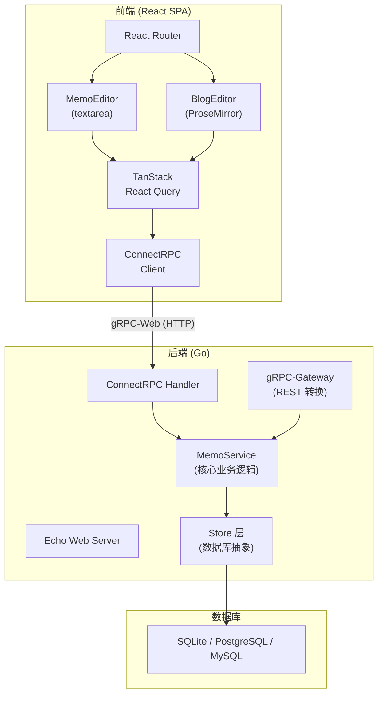
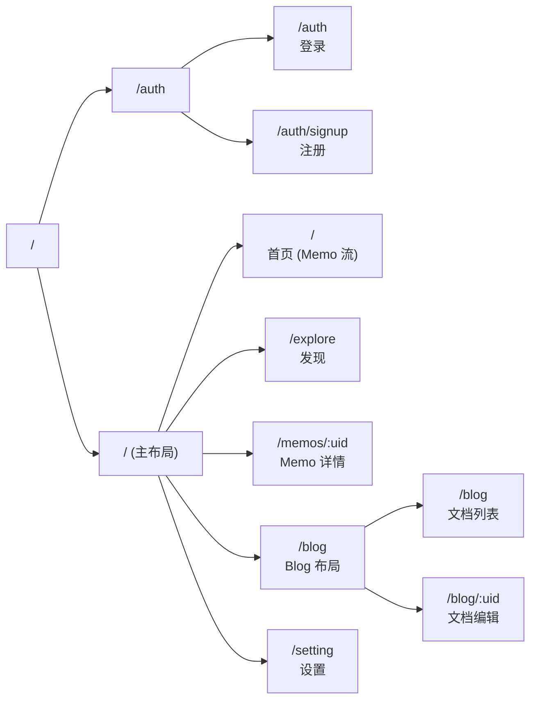
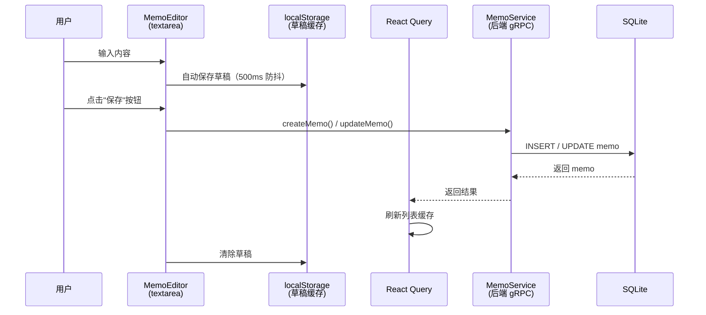
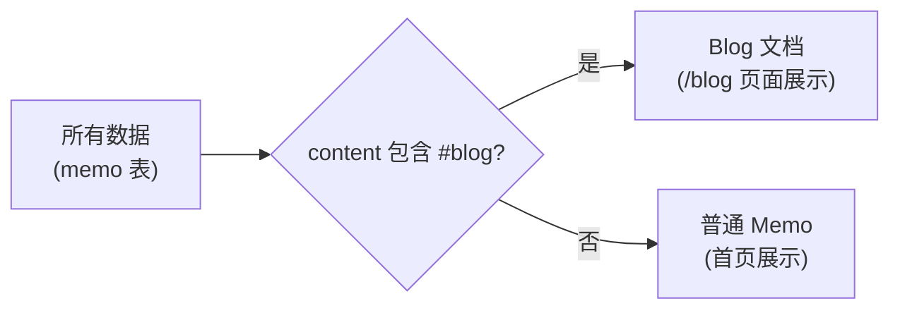
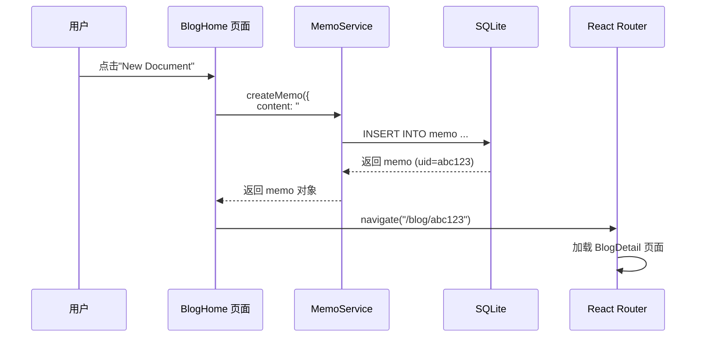
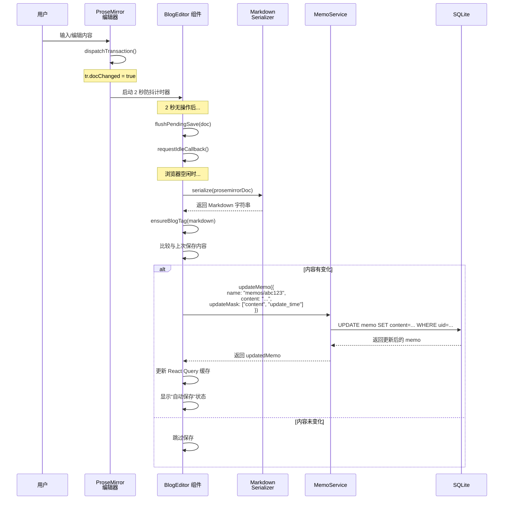
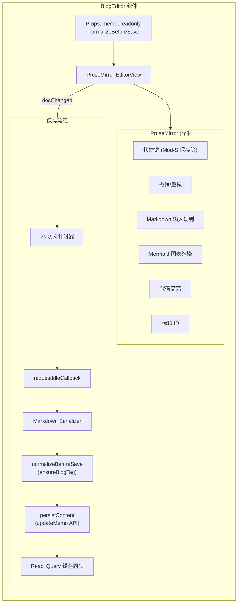
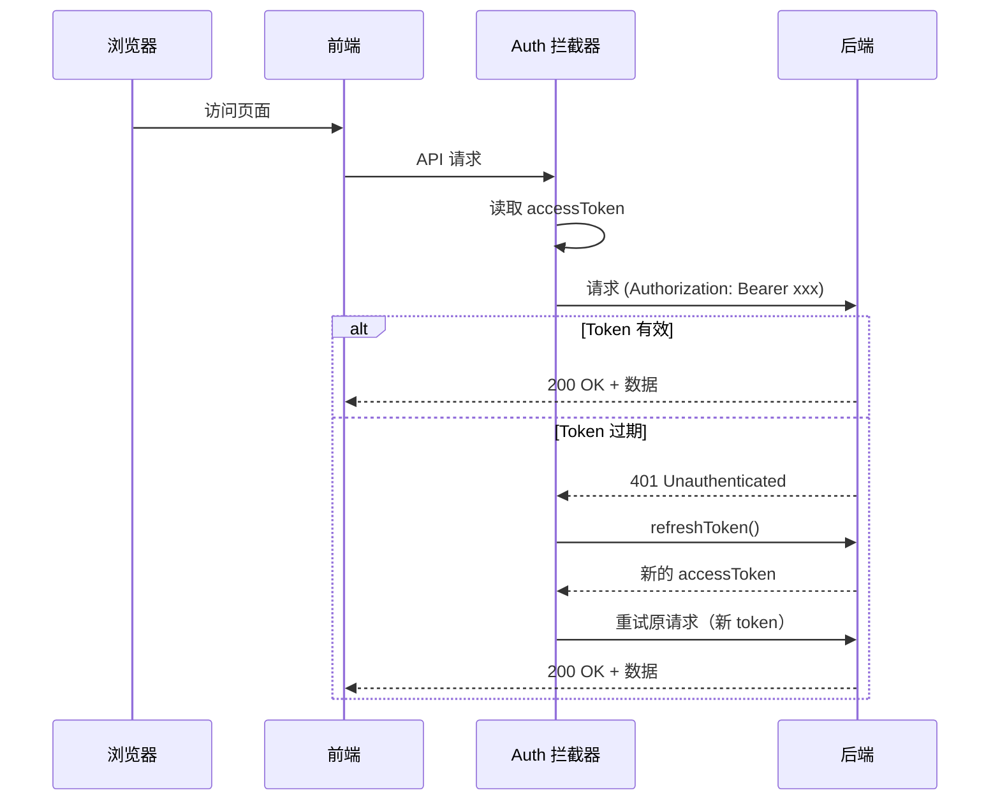

# Memos 服务设计文档

> 本文档描述 Austin/Memos 定制版的整体架构、核心功能、数据流，以及如何开发和部署该服务。
> 最后更新：2026-03-11

---

## 目录

1. [项目概览](#1-项目概览)
2. [技术栈](#2-技术栈)
3. [架构总览](#3-架构总览)
4. [数据模型](#4-数据模型)
5. [Memo 功能（短笔记）](#5-memo-功能短笔记)
6. [Blog 功能（长文档）](#6-blog-功能长文档)
7. [API 层（ConnectRPC）](#7-api-层connectrpc)
8. [认证与鉴权](#8-认证与鉴权)
9. [本地开发指南](#9-本地开发指南)
10. [部署指南](#10-部署指南)
11. [已知问题与注意事项](#11-已知问题与注意事项)

---

## 1. 项目概览

本项目是 [usememos/memos](https://github.com/usememos/memos) 的定制分支，在原版基础上增加了：

- **Blog 文档功能**：基于 ProseMirror 的富文本编辑器，支持所见即所得编辑和自动保存
- **Memo 分屏预览**：编辑器左侧写 Markdown，右侧实时预览
- **Outline 编辑器移植**：从 Outline wiki 项目移植了 ProseMirror 的命令和插件

### 核心设计理念

Blog 功能**没有**独立的数据表或 API 端点。Blog 文档本质上就是带有 `#blog` 标签的 Memo。区分方式完全通过前端的标签过滤实现：

```
Blog 文档 = Memo + #blog 标签
```

这意味着：
- 所有 Blog 的 CRUD 操作复用 Memo 的 gRPC API
- 主页（Home）通过 `!m.content.includes("#blog")` 排除 Blog 文档
- Blog 页面通过 `tag in ["blog"]` 过滤出 Blog 文档

---

## 2. 技术栈

### 后端（Go）

| 组件 | 技术 |
|------|------|
| 语言 | Go 1.25 |
| Web 框架 | Echo v4 |
| API 协议 | gRPC + ConnectRPC + gRPC-Gateway (REST) |
| 数据库 | SQLite（默认） / PostgreSQL / MySQL |
| 认证 | JWT (`golang-jwt/jwt/v5`) + OAuth2 |
| 文件存储 | 本地磁盘 / AWS S3 |
| Markdown 解析 | goldmark |

### 前端（React/TypeScript）

| 组件 | 技术 |
|------|------|
| 框架 | React 18 + TypeScript 5.9 |
| 构建工具 | Vite 7 |
| 路由 | React Router DOM v7 |
| 数据获取 | TanStack React Query v5 |
| API 客户端 | ConnectRPC (`@connectrpc/connect-web`) |
| 样式 | Tailwind CSS v4 + shadcn/ui + Radix UI |
| 富文本编辑器 | ProseMirror（Blog 功能） |
| 纯文本编辑器 | 原生 textarea（Memo 功能） |
| 国际化 | i18next |

---

## 3. 架构总览



### 前端路由结构



---

## 4. 数据模型

### memo 表（核心表）

```sql
CREATE TABLE memo (
  id          INTEGER PRIMARY KEY AUTOINCREMENT,
  uid         TEXT NOT NULL UNIQUE,           -- 全局唯一标识符
  creator_id  INTEGER NOT NULL,               -- 创建者 ID
  created_ts  BIGINT NOT NULL,                -- 创建时间（Unix 秒）
  updated_ts  BIGINT NOT NULL,                -- 更新时间（Unix 秒）
  row_status  TEXT NOT NULL DEFAULT 'NORMAL', -- 'NORMAL' | 'ARCHIVED'
  content     TEXT NOT NULL DEFAULT '',       -- Markdown 原文
  visibility  TEXT NOT NULL DEFAULT 'PRIVATE',-- 'PUBLIC' | 'PROTECTED' | 'PRIVATE'
  pinned      INTEGER NOT NULL DEFAULT 0,     -- 0=未置顶, 1=置顶
  payload     TEXT NOT NULL DEFAULT '{}'      -- JSON 扩展字段（包含解析出的 tags 等）
);
```

### 关键字段说明

| 字段 | 说明 |
|------|------|
| `uid` | 全局唯一 ID，用于构建资源名称 `memos/{uid}` |
| `content` | 存储原始 Markdown 文本。Blog 文档和 Memo 的内容格式完全一致 |
| `visibility` | `PRIVATE`=仅自己可见，`PROTECTED`=登录用户可见，`PUBLIC`=所有人可见 |
| `payload` | JSON 格式的扩展数据，后端自动解析 `content` 中的标签并存入 `payload.tags` |

### 资源命名规范

所有资源使用 `{collection}/{id}` 格式：
- 用户：`users/{id}`
- Memo/Blog：`memos/{uid}`
- 附件：`attachments/{uid}`

---

## 5. Memo 功能（短笔记）

### 数据流



### 关键组件

| 组件 | 路径 | 职责 |
|------|------|------|
| `MemoEditor` | `web/src/components/MemoEditor/index.tsx` | 入口，整合编辑器、工具栏、预览 |
| `EditorContent` | `web/src/components/MemoEditor/components/EditorContent.tsx` | 核心 textarea 编辑区域 |
| `EditorToolbar` | `web/src/components/MemoEditor/components/EditorToolbar.tsx` | 底部操作栏（保存、取消、附件等） |
| `EditorPreview` | `web/src/components/MemoEditor/components/EditorPreview.tsx` | 右侧 Markdown 实时预览 |
| `memoService` | `web/src/components/MemoEditor/services/memoService.ts` | 业务逻辑层（保存/更新 API 调用） |

### Memo 保存方式

- **手动保存**：用户点击工具栏的保存按钮，或按 `Cmd+Enter`
- **草稿缓存**：编辑器内容通过 `useAutoSave` hook 实时写入 `localStorage`（500ms 防抖），但**不会**自动保存到服务器
- 新建 Memo 调用 `createMemo()`，编辑已有 Memo 调用 `updateMemo()`

---

## 6. Blog 功能（长文档）

### 与 Memo 的关系



### 数据流 — Blog 文档创建



### 数据流 — Blog 文档编辑与自动保存



### 关键组件

| 组件 | 路径 | 职责 |
|------|------|------|
| `BlogLayout` | `web/src/layouts/BlogLayout.tsx` | Blog 区域布局（侧边栏 + 内容区） |
| `BlogExplorer` | `web/src/components/BlogExplorer.tsx` | 左侧文档列表 + 标签区域 |
| `BlogHome` | `web/src/pages/BlogHome.tsx` | Blog 首页，展示所有 Blog 文档卡片 |
| `BlogDetail` | `web/src/pages/BlogDetail.tsx` | Blog 编辑页，加载 BlogEditor |
| `BlogEditor` | `web/src/components/BlogEditor/index.tsx` | ProseMirror 富文本编辑器（核心） |

### BlogEditor 内部架构



### BlogEditor 自动保存机制详解

1. **触发条件**：任何导致 `tr.docChanged === true` 的 ProseMirror 事务
2. **防抖延迟**：2000ms（`AUTOSAVE_DELAY`），每次新编辑重置计时器
3. **序列化调度**：通过 `requestIdleCallback` 在浏览器空闲时执行，超时 1200ms（`SERIALIZE_IDLE_TIMEOUT`）
4. **序列化**：ProseMirror 文档 → Markdown 字符串
5. **规范化**：调用 `normalizeBeforeSave`（即 `ensureBlogTag`），确保 `#blog` 标签存在
6. **去重**：比较序列化后的内容与上次保存的内容，相同则跳过
7. **持久化**：调用 `memoServiceClient.updateMemo()` 发送到后端
8. **缓存同步**：成功后直接更新 React Query 缓存（不触发全量 refetch）

### 手动保存

- 快捷键：`Cmd+S`（Mac）/ `Ctrl+S`（Windows/Linux）
- 效果：立即清除防抖计时器 → 立即执行保存 → toast 提示"已保存"

### ensureBlogTag 函数

```typescript
function ensureBlogTag(content: string): string {
  const tagPattern = /(?:^|\s)#blog(?:\s|$)/m;
  if (tagPattern.test(content)) return content;   // 已有 #blog 标签，不变
  const trimmed = content.replace(/\n+$/, "");
  return trimmed + "\n\n" + "#blog" + "\n";        // 追加 #blog 标签
}
```

这个函数在每次保存前运行，确保 Blog 文档内容中始终包含 `#blog` 标签。如果用户不小心删除了 `#blog`，保存时会自动补回。

### Blog 文档与 Memo 详情页的共用

`MemoDetail` 页面（`/memos/:uid`）也使用 `BlogEditor` 来编辑 Memo，但**不传** `normalizeBeforeSave`，因此不会自动添加 `#blog` 标签。这意味着：

- `/blog/:uid` → 使用 BlogEditor + ensureBlogTag → 保存后仍是 Blog
- `/memos/:uid` → 使用 BlogEditor（无 ensureBlogTag）→ 保存后不会变成 Blog

---

## 7. API 层（ConnectRPC）

### 前端 API 客户端

所有 API 调用通过 `web/src/connect.ts` 中创建的 ConnectRPC 客户端进行：

```typescript
const transport = createConnectTransport({
  baseUrl: window.location.origin,
  useBinaryFormat: false,
  fetch: fetchWithCredentials,  // 携带 cookie 凭据
  interceptors: [authInterceptor],  // 自动附加 JWT token
});

export const memoServiceClient = createClient(MemoService, transport);
```

### Memo/Blog 相关 API

| 操作 | gRPC 方法 | HTTP 端点 | 说明 |
|------|-----------|-----------|------|
| 创建 | `CreateMemo` | `POST /api/v1/memos` | 创建新 Memo/Blog |
| 列表 | `ListMemos` | `GET /api/v1/memos` | 支持 filter、pageSize、orderBy |
| 获取 | `GetMemo` | `GET /api/v1/memos/{uid}` | 按 name 获取单个 |
| 更新 | `UpdateMemo` | `PATCH /api/v1/memos/{uid}` | 带 FieldMask 部分更新 |
| 删除 | `DeleteMemo` | `DELETE /api/v1/memos/{uid}` | 软删除 |
| 评论 | `CreateMemoComment` | `POST /api/v1/memos/{uid}/comments` | 创建评论（子 Memo） |
| 评论列表 | `ListMemoComments` | `GET /api/v1/memos/{uid}/comments` | 获取评论列表 |

### React Query Hooks

| Hook | 文件 | 用途 |
|------|------|------|
| `useMemos(request)` | `useMemoQueries.ts` | 列表查询，支持 filter/pageSize/orderBy |
| `useInfiniteMemos(request)` | `useMemoQueries.ts` | 无限滚动列表查询 |
| `useMemo(name)` | `useMemoQueries.ts` | 单个 Memo 查询（5 分钟 staleTime） |
| `useCreateMemo()` | `useMemoQueries.ts` | 创建 Memo mutation |
| `useUpdateMemo(options)` | `useMemoQueries.ts` | 更新 Memo mutation（支持乐观更新） |
| `useDeleteMemo()` | `useMemoQueries.ts` | 删除 Memo mutation |
| `useMemoComments(name)` | `useMemoQueries.ts` | 评论列表查询 |

### 标签过滤（CEL 表达式）

后端使用 CEL（Common Expression Language）进行过滤，前端通过 `filter` 参数传递：

```
# Blog 文档过滤
filter: 'tag in ["blog"]'

# 多条件组合
filter: 'tag in ["blog"] && visibility in ["PUBLIC"]'
```

后端实现在 `server/router/api/v1/memo_service_filter.go`。

---

## 8. 认证与鉴权

### 认证流程



### 权限模型

| 角色 | 权限 |
|------|------|
| `HOST` | 超级管理员，可管理所有用户和内容 |
| `ADMIN` | 管理员，可管理内容 |
| `USER` | 普通用户，只能管理自己的内容 |

### Blog 编辑权限

```typescript
const isOwner = currentUser && memo.creator === currentUser.name;
const canEdit = isOwner || isSuperUser(currentUser);  // HOST 或 ADMIN
const readonly = !canEdit;
```

---

## 9. 本地开发指南

### 前置条件

- Go 1.25+
- Node.js 20+ & npm
- 可选：Docker（用于容器化部署）

### 方式一：完整开发模式（推荐）

```bash
# 1. 构建后端
cd /path/to/austin/memos
go build -o build/memos ./bin/memos

# 2. 启动后端（开发模式）
./build/memos --mode dev --port 8081 > /tmp/memos.log 2>&1 &

# 3. 安装前端依赖
cd web
npm install

# 4. 启动前端开发服务器（Vite，支持热重载）
npm run dev
# 默认在 http://localhost:3001 启动（如被占用则 3002）
```

### 方式二：Docker 开发模式

```bash
cd /path/to/austin/memos

# 1. 先构建前端
cd web && npm install && npm run build && cd ..

# 2. 启动 Docker 容器（挂载本地构建的前端）
docker compose -f docker-compose.dev.yml up -d

# 访问 http://localhost:8081
```

`docker-compose.dev.yml` 使用官方镜像，但将本地构建的前端 `web/dist` 挂载覆盖容器内的前端文件。

### 开发时的 API 代理

前端 Vite 开发服务器通过 `vite.config.mts` 中的 proxy 配置，将 `/api`, `/memos.api.v1` 等路径代理到后端 `http://localhost:8081`。

### 前端项目结构

```
web/src/
├── components/
│   ├── BlogEditor/         # ProseMirror Blog 编辑器
│   │   ├── index.tsx        # 主组件（自动保存、手动保存）
│   │   ├── lib/
│   │   │   ├── schema.ts            # ProseMirror schema 定义
│   │   │   ├── markdownParser.ts     # Markdown → ProseMirror 解析
│   │   │   ├── markdownSerializer.ts # ProseMirror → Markdown 序列化
│   │   │   ├── docCache.ts           # IndexedDB 文档缓存
│   │   │   └── inputRules.ts         # Markdown 快捷输入规则
│   │   └── plugins/                  # ProseMirror 插件
│   ├── BlogExplorer.tsx     # Blog 侧边栏文档列表
│   ├── MemoEditor/          # Memo 编辑器（textarea）
│   │   ├── index.tsx        # 主组件
│   │   ├── services/        # 业务逻辑（保存、上传）
│   │   ├── state/           # 状态管理（useReducer）
│   │   └── hooks/           # 自定义 hooks
│   └── MemoView/            # Memo 渲染（卡片视图）
├── pages/
│   ├── Home.tsx             # 首页（Memo 流，排除 #blog）
│   ├── BlogHome.tsx         # Blog 文档列表
│   ├── BlogDetail.tsx       # Blog 编辑页
│   └── MemoDetail.tsx       # Memo 详情页
├── layouts/
│   ├── BlogLayout.tsx       # Blog 区域布局
│   ├── MainLayout.tsx       # 主内容区布局
│   └── RootLayout.tsx       # 根布局
├── hooks/
│   ├── useMemoQueries.ts    # Memo CRUD React Query hooks
│   └── useUserQueries.ts    # User 相关 hooks
├── connect.ts               # ConnectRPC 客户端配置
├── router/index.tsx         # 路由定义
└── outline-vendor/          # 从 Outline 移植的 ProseMirror 工具
```

---

## 10. 部署指南

### 方式一：Docker 部署（推荐）

```bash
# 使用自定义 Dockerfile 构建
cd /path/to/austin/memos
docker build -f scripts/Dockerfile -t memos-custom .

# 运行
docker run -d \
  --name memos \
  -p 8081:5230 \
  -v ~/.memos:/var/opt/memos \
  -e MEMOS_MODE=prod \
  -e MEMOS_PORT=5230 \
  memos-custom
```

### 方式二：Docker Compose 部署

```yaml
# docker-compose.dev.yml
version: "3.8"
services:
  memos:
    image: ghcr.io/usememos/memos:latest
    container_name: memos
    ports:
      - 8081:5230
    volumes:
      - ~/.memos:/var/opt/memos          # 数据持久化
      - ./web/dist:/usr/local/memos/web/dist  # 覆盖前端
    environment:
      - MEMOS_MODE=prod
      - MEMOS_PORT=5230
    restart: unless-stopped
```

### 数据持久化

- **SQLite 数据库**：`~/.memos/memos_prod.db`（默认路径 `/var/opt/memos/` 在容器内）
- **附件存储**：根据配置存储在本地磁盘或 S3
- **备份**：定期备份 SQLite 文件即可（或使用数据库的备份工具）

### 环境变量

| 变量 | 默认值 | 说明 |
|------|--------|------|
| `MEMOS_MODE` | `demo` | `prod` / `dev` / `demo` |
| `MEMOS_PORT` | `5230` | 服务监听端口 |
| `MEMOS_DSN` | (空) | 数据库连接字符串（PostgreSQL/MySQL） |

---

## 11. 已知问题与注意事项

### Blog 自动保存相关

BlogEditor 的自动保存依赖以下条件**全部满足**：

1. **编辑器必须不是 `readonly` 模式**：`readonlyRef.current === false`
2. **ProseMirror 事务必须包含文档变更**：`tr.docChanged === true`
3. **`skipNextSaveRef` 必须为 false**：该标志在外部内容同步（如 React Query refetch 导致的内容更新）时被设为 true，以避免循环保存
4. **`requestIdleCallback` 必须被触发**：某些浏览器在后台标签页中可能不触发
5. **API 调用必须成功**：需要有效的认证 token 和网络连接

**常见问题排查**：

- 如果 Blog 不自动保存，打开浏览器控制台（F12）查看是否有报错
- 确认已登录且有编辑权限（需要是文档的创建者或超级用户）
- 确认编辑器底部显示"自动保存"而非"只读"状态
- 尝试 `Cmd+S` 手动保存，观察是否有 toast 提示

### React Query staleTime 说明

`useMemo` hook 的 `staleTime` 设为 5 分钟：

```typescript
staleTime: 1000 * 60 * 5,
// 频繁 refetch 会导致 BlogEditor 重新挂载，丢失滚动位置和编辑器状态
```

这意味着 5 分钟内不会触发自动 refetch。BlogEditor 的保存成功后会直接更新 React Query 缓存（通过 `syncMemoToDetailCache` 和 `syncMemoToListCaches`），不依赖 refetch。

### MemoDetail 页面的 lockedMemoRef

`MemoDetail.tsx` 使用 `lockedMemoRef` 锁定传给 BlogEditor 的 memo 引用，避免 React Query refetch 产生新对象引用导致 BlogEditor 不必要的重渲染：

```typescript
const lockedMemoRef = useRef(memo);
if (memo && (!lockedMemoRef.current || lockedMemoRef.current.name !== memo.name)) {
  lockedMemoRef.current = memo;
}
const stableMemo = lockedMemoRef.current ?? memo;
```

### 首页排除 Blog 的机制

`Home.tsx` 通过客户端过滤排除 Blog 文档：

```typescript
const filtered = list.filter((m) => !m.content.includes("#blog"));
```

这是一个简单的字符串匹配，如果 Memo 内容中碰巧包含 `#blog` 字符串（即使不是作为标签），也会被排除。

---

## 附录：快捷键一览

### BlogEditor 快捷键

| 快捷键 | 功能 |
|--------|------|
| `Cmd+S` | 手动保存 |
| `Cmd+B` | 加粗 |
| `Cmd+I` | 斜体 |
| `Cmd+U` | 下划线 |
| `Cmd+D` | 删除线 |
| `Cmd+E` | 行内代码 |
| `Cmd+K` | 插入/编辑链接 |
| `Cmd+Z` | 撤销 |
| `Cmd+Shift+Z` / `Cmd+Y` | 重做 |
| `Shift+Ctrl+1~6` | 标题 1-6 |
| `Shift+Ctrl+7` | 清单列表 |
| `Shift+Ctrl+8` | 无序列表 |
| `Shift+Ctrl+9` | 有序列表 |
| `Shift+Ctrl+C` | 代码块 |
| `Ctrl+>` | 引用块 |
| `Cmd+Alt+↑/↓` | 上下移动段落 |
| `Tab` | 增加缩进 |
| `Shift+Tab` | 减少缩进 |
| `Escape` | 退出编辑器焦点 |

### MemoEditor 快捷键

| 快捷键 | 功能 |
|--------|------|
| `Cmd+Enter` | 保存 |
| `Cmd+B` | 加粗 |
| `Cmd+I` | 斜体 |
| `Cmd+E` | 行内代码 |
| `Cmd+K` | 插入链接 |

---

## 附录：文件索引

| 功能区域 | 关键文件 |
|----------|----------|
| 路由定义 | `web/src/router/index.tsx` |
| API 客户端 | `web/src/connect.ts` |
| Memo CRUD hooks | `web/src/hooks/useMemoQueries.ts` |
| Blog 首页 | `web/src/pages/BlogHome.tsx` |
| Blog 编辑页 | `web/src/pages/BlogDetail.tsx` |
| Blog 编辑器 | `web/src/components/BlogEditor/index.tsx` |
| Blog 侧边栏 | `web/src/components/BlogExplorer.tsx` |
| Blog 布局 | `web/src/layouts/BlogLayout.tsx` |
| Memo 首页 | `web/src/pages/Home.tsx` |
| Memo 详情页 | `web/src/pages/MemoDetail.tsx` |
| Memo 编辑器 | `web/src/components/MemoEditor/index.tsx` |
| 数据库 schema | `store/migration/sqlite/LATEST.sql` |
| gRPC Proto 定义 | `proto/api/v1/memo_service.proto` |
| Memo 后端服务 | `server/router/api/v1/memo_service.go` |
| Memo 过滤器 | `server/router/api/v1/memo_service_filter.go` |
| Memo 数据存储 | `store/memo.go` |
| Docker Compose | `docker-compose.dev.yml` |
| Dockerfile | `scripts/Dockerfile` |
