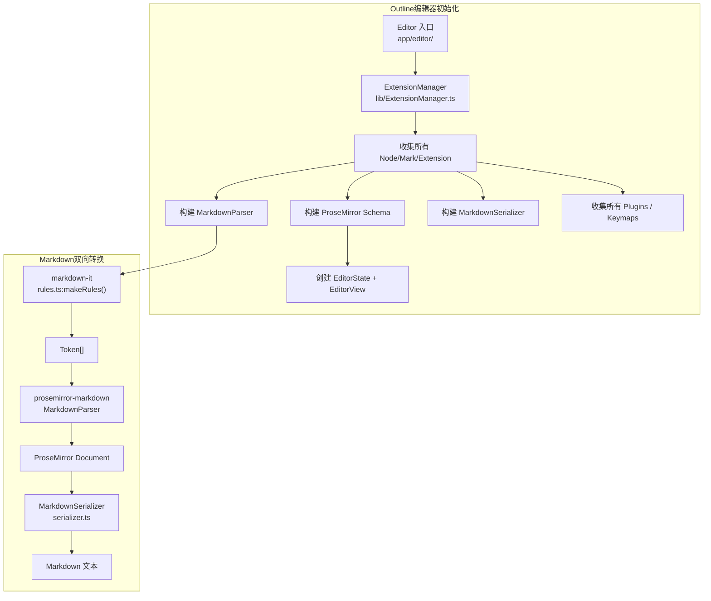
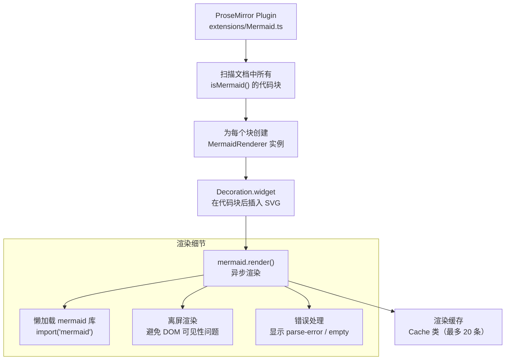
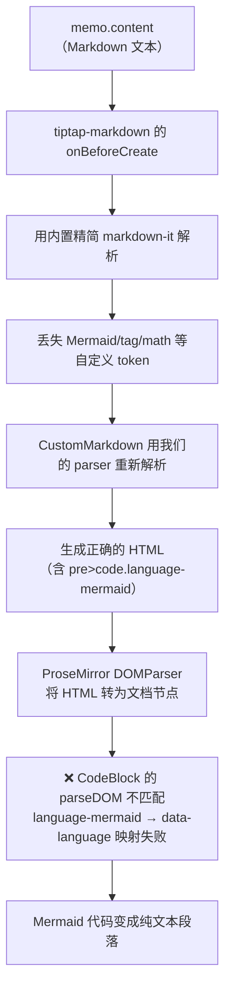
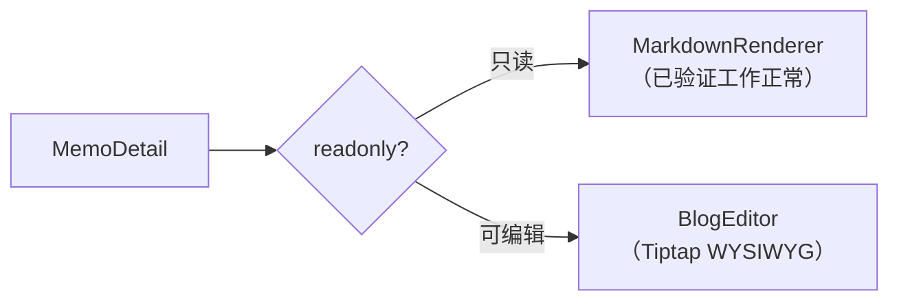
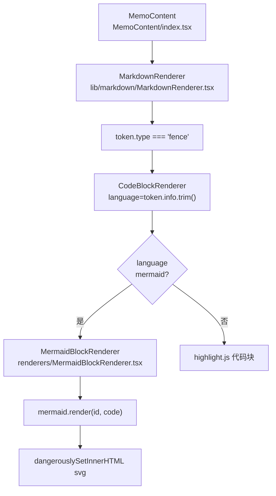
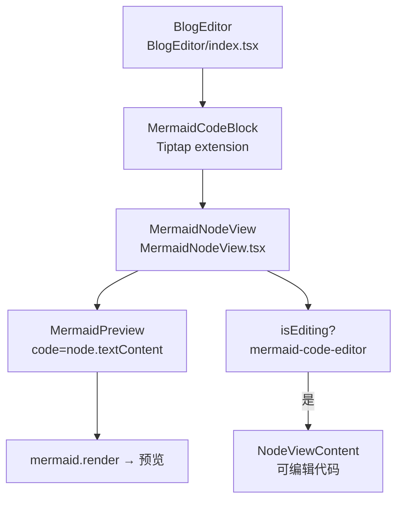

# Outline-Source 编辑器架构与 Memos 复用分析

## 1. Outline-Source 编辑器架构总览

Outline 使用的是**原生 ProseMirror** 编辑器（非 Tiptap），通过自定义的 Extension/Node/Mark 体系实现 Markdown 双向转换和 Mermaid 渲染。

### 1.1 目录结构

```
outline-source/shared/editor/
├── lib/                          # 核心库
│   ├── ExtensionManager.ts       # 扩展管理器（聚合所有节点/标记/插件）
│   ├── Extension.ts              # 扩展基类
│   ├── markdown/
│   │   ├── rules.ts              # markdown-it 实例构建
│   │   └── serializer.ts         # ProseMirror → Markdown 序列化器（fork 自 prosemirror-markdown）
│   └── isCode.ts                 # isCode() / isMermaid() 判断
├── nodes/                        # ProseMirror 节点
│   ├── Node.ts                   # 节点抽象基类
│   ├── CodeFence.ts              # ``` 代码块（362行，含 Mermaid 插件注册）
│   ├── CodeBlock.ts              # 缩进代码块（继承 CodeFence，22行）
│   ├── Heading.ts, Paragraph.ts, Table.ts ...
│   └── index.ts                  # 三套预设：inlineExtensions / basicExtensions / richExtensions
├── marks/                        # ProseMirror 标记（Bold, Italic, Link, Code 等）
├── extensions/                   # 扩展插件
│   ├── Mermaid.ts                # Mermaid 渲染插件（446行，ProseMirror Decoration）
│   ├── CodeHighlighting.ts       # 代码块语法高亮
│   └── ...
├── rules/                        # markdown-it 自定义规则
│   ├── tables.ts, notices.ts, embeds.ts, math.ts, checkboxes.ts ...
├── commands/                     # 编辑命令
├── plugins/                      # ProseMirror 插件
└── components/                   # React UI 组件
```

### 1.2 技术栈对比

| 项目 | Outline-Source | Memos（当前） |
|------|---------------|--------------|
| 编辑器框架 | **原生 ProseMirror** | **Tiptap**（ProseMirror 上层封装） |
| Markdown 解析 | `markdown-it` → `prosemirror-markdown.MarkdownParser` | `tiptap-markdown`（内置 markdown-it）+ 自定义 `CustomMarkdown` |
| Markdown 序列化 | 自制 `MarkdownSerializer`（fork 自 prosemirror-markdown） | `tiptap-markdown` 的 `getMarkdown()` |
| Mermaid 渲染 | **ProseMirror `Decoration.widget`**（插件级） | **Tiptap `ReactNodeViewRenderer`**（React 组件级） |
| 节点体系 | `Extension → Node → CodeFence` 继承链 | Tiptap 的 `Extension.create()` / `Node.create()` |

### 1.3 核心架构流程图



---

## 2. Outline-Source 的 Markdown 解析实现

### 2.1 解析链路

```
Markdown 文本
  ↓ makeRules() 创建 markdown-it 实例
  ↓ 加载各 Extension 的 rulePlugins（tables, notices, embeds, math 等）
  ↓ markdown-it.parse() → Token[]
  ↓ prosemirror-markdown.MarkdownParser 根据各节点的 parseMarkdown() 映射
  ↓ ProseMirror Document
```

### 2.2 关键代码

#### ExtensionManager.parser()

```14:42:outline-source/shared/editor/lib/markdown/rules.ts
export default function makeRules({ rules = {}, plugins = [], schema }: Options) {
  const markdownIt = markdownit("default", {
    breaks: false,
    html: false,
    linkify: false,
    ...rules,
  });
  // 根据 schema 禁用不支持的规则 ...
  plugins.forEach((plugin) => markdownIt.use(plugin));
  return markdownIt;
}
```

```134:164:outline-source/shared/editor/lib/ExtensionManager.ts
  parser({ schema, rules, plugins }: { ... }): MarkdownParser {
    const tokens = this.extensions
      .filter((ext) => ext.type === "mark" || ext.type === "node")
      .reduce((nodes, extension: Node | Mark) => {
        const parseSpec = extension.parseMarkdown();
        if (!parseSpec) return nodes;
        return {
          ...nodes,
          [extension.markdownToken || extension.name]: parseSpec,
        };
      }, {});
    return new MarkdownParser(schema, makeRules({ rules, schema, plugins }), tokens);
  }
```

**核心机制**：每个 Node/Mark 通过 `parseMarkdown()` 和 `markdownToken` 定义自己的 Token→Node 映射规则，`ExtensionManager` 自动汇总。

### 2.3 序列化链路

```
ProseMirror Document
  ↓ ExtensionManager.serializer() 收集各节点的 toMarkdown()
  ↓ MarkdownSerializer.serialize(doc)
  ↓ Markdown 文本
```

```110:132:outline-source/shared/editor/lib/ExtensionManager.ts
  serializer() {
    const nodes = this.extensions
      .filter((ext) => ext.type === "node")
      .reduce((memo, ext: Node) => ({ ...memo, [ext.name]: ext.toMarkdown }), {});
    const marks = this.extensions
      .filter((ext) => ext.type === "mark")
      .reduce((memo, ext: Mark) => ({ ...memo, [ext.name]: ext.toMarkdown }), {});
    return new MarkdownSerializer(nodes, marks);
  }
```

---

## 3. Outline-Source 的 CodeFence + Mermaid 实现

### 3.1 CodeFence 节点

```49:113:outline-source/shared/editor/nodes/CodeFence.ts
export default class CodeFence extends Node {
  get name() { return "code_fence"; }

  get schema(): NodeSpec {
    return {
      attrs: { language: { default: "javascript" } },
      content: "text*",
      marks: "comment",
      group: "block",
      code: true,
      parseDOM: [
        { tag: ".code-block", getAttrs: (dom) => ({ language: dom.dataset.language }) },
        { tag: "code", getAttrs: (dom) => {
            if (!dom.textContent?.includes("\n")) return false; // 单行不算代码块
            return { language: dom.dataset.language };
          }
        },
      ],
      toDOM: (node) => [
        "div", { class: "code-block", "data-language": node.attrs.language },
        ["pre", ["code", { spellCheck: "false" }, 0]],
      ],
    };
  }
```

#### Markdown 解析/序列化

```343:361:outline-source/shared/editor/nodes/CodeFence.ts
  toMarkdown(state, node) {
    state.write("```" + (node.attrs.language || "") + "\n");
    state.text(node.textContent, false);
    state.ensureNewLine();
    state.write("```");
    state.closeBlock(node);
  }

  get markdownToken() { return "fence"; }  // 对应 markdown-it 的 fence token

  parseMarkdown() {
    return {
      block: "code_block",           // 映射到 code_block 节点类型
      getAttrs: (tok) => ({ language: tok.info }),  // tok.info = "mermaid"
      noCloseToken: true,
    };
  }
```

**要点**：`markdownToken` 是 `"fence"`（markdown-it 的 token 名），但 `parseMarkdown()` 映射到 `block: "code_block"` 节点。这意味着 Outline 的 Schema 中 `code_fence` 和 `code_block` 共享同一个底层节点类型（`code_block`），`code_fence` 只是注册了更多插件（Mermaid、代码高亮等）。

#### Mermaid 插件注册

```251:261:outline-source/shared/editor/nodes/CodeFence.ts
  get plugins() {
    return [
      CodeHighlighting({ name: this.name, lineNumbers: this.showLineNumbers }),
      this.name === "code_fence"
        ? Mermaid({ isDark: this.editor.props.theme.isDark, editor: this.editor })
        : undefined,
      // ... 其他插件
    ].filter(Boolean);
  }
```

**关键**：Mermaid 插件 **仅在 `code_fence`（name === "code_fence"）中注册**，`code_block` 不注册。

### 3.2 Mermaid 插件（Decoration 方式）

Outline 的 Mermaid 不是独立的 Node 类型，而是一个 **ProseMirror Plugin**，用 `Decoration.widget` 在 `language === "mermaid"` 的代码块后面插入 SVG。



#### 核心渲染代码

```62:124:outline-source/shared/editor/extensions/Mermaid.ts
class MermaidRenderer {
  render = async (block, isDark) => {
    const text = block.node.textContent;
    const cacheKey = `${isDark ? "dark" : "light"}-${text}`;
    const cache = Cache.get(cacheKey);
    if (cache) { element.innerHTML = cache; return; }

    // 创建离屏元素渲染（Mermaid 要求元素可见）
    const renderElement = document.createElement("div");
    renderElement.style.position = "absolute";
    renderElement.style.left = "-9999px";
    document.body.appendChild(renderElement);

    try {
      mermaid ??= (await import("mermaid")).default;  // 懒加载
      mermaid.initialize({
        startOnLoad: true,
        suppressErrorRendering: true,
        theme: isDark ? "dark" : "default",
      });
      const { svg, bindFunctions } = await mermaid.render(tempId, text);
      Cache.set(cacheKey, svg);
      element.innerHTML = svg;
      bindFunctions?.(element);  // 允许交互
    } catch (error) {
      element.innerText = error;
      element.classList.add("parse-error");
    } finally {
      renderElement.remove();
    }
  };
}
```

#### 状态管理

```159:218:outline-source/shared/editor/extensions/Mermaid.ts
function getNewState({ doc, pluginState, editor }): MermaidState {
  const blocks = findBlockNodes(doc).filter((item) => isMermaid(item.node));
  blocks.forEach((block) => {
    // 复用已有的 renderer（避免重复渲染）
    const renderer = bestDecoration?.spec?.renderer ?? new MermaidRenderer(editor);
    // 在代码块后面插入 Decoration.widget（SVG 图表）
    const diagramDecoration = Decoration.widget(
      block.pos + block.node.nodeSize,
      () => { renderer.render(block, pluginState.isDark); return renderer.element; },
      { diagramId: renderer.diagramId, renderer, side: -10 }
    );
    decorations.push(diagramDecoration);
  });
  return { ...pluginState, decorationSet: DecorationSet.create(doc, decorations) };
}
```

#### 编辑模式切换

```126:154:outline-source/shared/editor/nodes/CodeFence.ts
  commands({ type, schema }) {
    return {
      edit_mermaid: (): Command => (state, dispatch) => {
        const codeBlock = findParentNode(isCode)(state.selection);
        if (!codeBlock || !isMermaid(codeBlock.node)) return false;
        // toggle editingId → 显示/隐藏代码
        dispatch(state.tr.setMeta(mermaidPluginKey, {
          editingId: mermaidState?.editingId === diagramId ? undefined : diagramId,
        }));
        return true;
      },
    };
  }
```

#### 只读模式行为

```368:378:outline-source/shared/editor/extensions/Mermaid.ts
  // 只读模式下点击图表 → 打开灯箱查看
  if (selected || editor.props.readOnly) {
    editor.updateActiveLightboxImage(
      LightboxImageFactory.createLightboxImage(view, $pos.before())
    );
    return true;
  }
```

### 3.3 isMermaid() 判断

```1:10:outline-source/shared/editor/lib/isCode.ts
export function isCode(node: Node) {
  return node.type.name === "code_block" || node.type.name === "code_fence";
}

export function isMermaid(node: Node) {
  return isCode(node) && (node.attrs.language === "mermaid" || node.attrs.language === "mermaidjs");
}
```

---

## 4. Memos 当前的问题

### 4.1 两条渲染路径

Memos 当前存在两条独立的渲染路径：

| 路径 | 使用位置 | 技术栈 | Mermaid 状态 |
|------|---------|--------|-------------|
| **A: BlogEditor** | MemoDetail 详情页 | Tiptap + tiptap-markdown + CustomMarkdown | **不工作** |
| **B: MarkdownRenderer** | 列表卡片、评论区 | markdown-it → Token → React | **工作正常** |

### 4.2 路径 A 失败的根因



**根因**：Tiptap 的 CodeBlock 扩展的 `parseDOM` 期望 `data-language` 属性或 `.code-block` class，但 markdown-it 渲染出的标准 HTML 是 `<pre><code class="language-mermaid">`。两者的 HTML 格式不匹配，导致代码块无法被正确识别。

---

## 5. Memos 如何直接使用 Outline-Source 的 Markdown 实现

### 5.1 核心思路

Outline 的设计哲学与 Memos 的关键差异：

| Outline 的做法 | Memos 当前的做法 |
|---------------|-----------------|
| Markdown → `prosemirror-markdown.MarkdownParser` → ProseMirror Doc | Markdown → `markdown-it.render()` → HTML → `tiptap-markdown` 重解析 → Tiptap Doc |
| 解析器直接生成带 `language` 属性的 `code_block` 节点 | HTML 中间层导致 `language` 属性丢失 |
| Mermaid 是 ProseMirror Decoration（不改变节点类型） | Mermaid 是 Tiptap ReactNodeView（需要正确的 language 识别） |

### 5.2 可行方案分析

#### 方案 A：详情页只读时用 MarkdownRenderer，编辑时用 BlogEditor（**推荐，最小改动**）



**改动范围**：仅修改 `MemoDetail.tsx`，约 10 行代码。

**优点**：
- MarkdownRenderer 路径的 Mermaid（MermaidBlockRenderer）已验证工作正常
- 改动最小，风险最低
- 只读渲染性能更好（无 ProseMirror 开销）

**缺点**：
- 只读↔编辑切换时视觉可能有微小差异（两套渲染器的样式不完全一致）
- 编辑模式下的 Mermaid 问题仍然存在（需要独立修复）

#### 方案 B：移植 Outline 的 prosemirror-markdown 解析方式到 BlogEditor（**中等改动**）

用 `prosemirror-markdown.MarkdownParser` 替代 `tiptap-markdown`，直接将 Markdown 解析为 ProseMirror 文档，跳过 HTML 中间层。

**需要移植的文件**：
1. `prosemirror-markdown` 的 `MarkdownParser`（npm 包已有）
2. 自定义 `parseMarkdown()` 规则（参考 Outline 的 CodeFence.parseMarkdown）
3. 自制 `MarkdownSerializer`（参考 Outline 的 serializer.ts）

**改动范围**：
- 删除 `tiptap-markdown` 依赖和 `CustomMarkdown.ts`
- 新增 `MarkdownParser` 配置（~100行）
- 新增 `MarkdownSerializer` 配置（~100行）
- 修改 `BlogEditor/index.tsx` 的初始化逻辑

**优点**：
- 根本解决 Markdown→ProseMirror 的转换问题
- 编辑模式下 Mermaid 也能正确工作

**缺点**：
- 改动较大，需要仔细处理所有节点类型的映射
- 序列化器需要为每种 Tiptap 节点编写 `toMarkdown` 规则

#### 方案 C：移植 Outline 的 Mermaid Decoration 插件（**大改动**）

将 Outline 的 `extensions/Mermaid.ts` 移植到 Memos，替换现有的 `MermaidCodeBlock` + `MermaidNodeView`。

**需要移植的文件**：
1. `extensions/Mermaid.ts` → 调整为 Tiptap 插件
2. `lib/isCode.ts` → `isMermaid()` 判断

**优点**：
- 与 Outline 完全一致的 Mermaid 体验（含缓存、灯箱、编辑模式切换）

**缺点**：
- 需要适配 Tiptap 的插件注册机制
- 仍然需要先解决方案 B 的 Markdown 解析问题

### 5.3 推荐实施路径

```
阶段1（立即）：方案 A — 详情页只读用 MarkdownRenderer
       ↓  解决只读渲染的 Mermaid 问题
阶段2（后续）：修复 BlogEditor 的 CodeBlock parseDOM
       ↓  让编辑模式也能正确识别 language-mermaid
阶段3（可选）：方案 B — 用 prosemirror-markdown 替代 tiptap-markdown
       ↓  根本解决 Markdown↔ProseMirror 转换问题
```

---

## 6. Memos 当前的 Mermaid 渲染（路径 B — 工作正常）

### 6.1 只读渲染链路（MarkdownRenderer）



### 6.2 编辑渲染链路（BlogEditor — 当前有问题）



---

## 7. Outline vs Memos Mermaid 实现对比

| 特性 | Outline | Memos（MermaidNodeView） | Memos（MermaidBlockRenderer） |
|------|---------|--------------------------|-------------------------------|
| 渲染方式 | ProseMirror Decoration.widget | Tiptap ReactNodeViewRenderer | React 组件直接渲染 |
| 缓存 | 有（Cache 类，20条上限） | 无 | 无 |
| 懒加载 mermaid | 有（dynamic import） | 无（直接 import） | 无（直接 import） |
| 离屏渲染 | 有（避免 DOM 可见性问题） | 无 | 无 |
| 暗黑主题切换 | 有（transaction meta 检测） | 有（useAuth + theme） | 有（useAuth + theme） |
| 编辑模式 | editingId 状态 toggle | isEditing useState toggle | 无（只读） |
| 只读灯箱 | 有（LightboxImageFactory） | 无 | 无 |
| 错误处理 | 显示错误文本 + CSS class | 显示错误信息 + 重新渲染按钮 | 显示错误信息 |
| 代码规范化 | 无 | 有（normalizeMermaidCode） | 有（normalizeMermaidCode） |

---

## 8. 已做修复记录

1. **Markdown 中 Mermaid 识别**：`token.info` 使用 `trim().toLowerCase()`
2. **编辑/隐藏代码按钮**：文案区分「显示代码」⇄「隐藏代码」
3. **渲染失败处理**：错误提示 + 「重新渲染」按钮
4. **Tag 过滤修复**：`safeFilterValue` 去除特殊字符
5. **Tiptap 重复扩展名修复**：禁用 StarterKit 的 link/underline
6. **CustomMarkdown 扩展**：用项目的 markdown-it parser 替代 tiptap-markdown 内置的
7. **数据恢复**：修复因自动保存 bug 清空的 memo 内容
